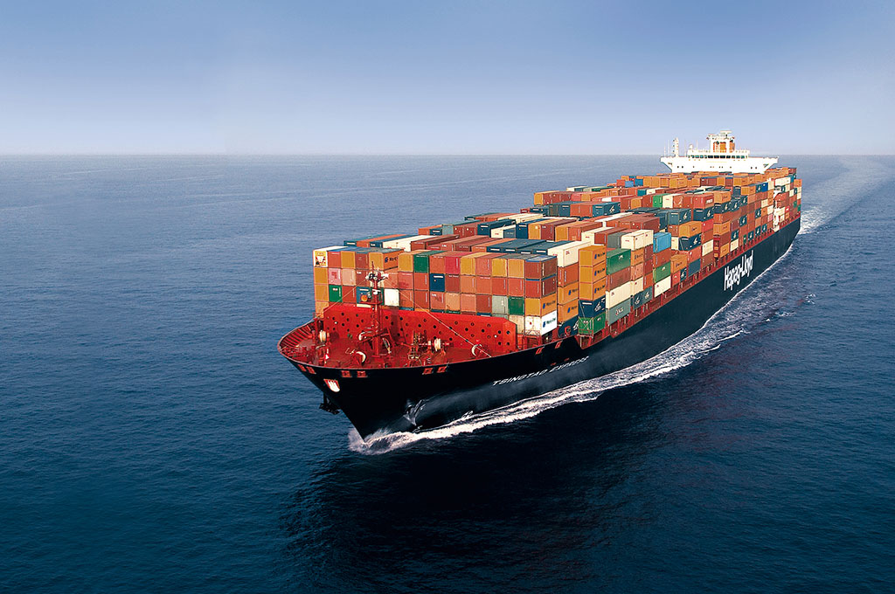

# O que é Containers?

Contêineres na computação são uma tecnologia que permite empacotar e distribuir aplicativos juntamente com todas as suas dependências e configurações em um único pacote isolado. Cada contêiner é uma unidade de software leve, portátil e auto-suficiente que inclui tudo o que é necessário para executar o aplicativo: código, bibliotecas, ferramentas e configurações.

## 📌 Essa abordagem de empacotamento oferece várias vantagens:

**Portabilidade:** Os contêineres são executados em qualquer ambiente compatível com a plataforma de contêineres, garantindo que o aplicativo funcione da mesma forma em qualquer lugar, desde o desenvolvimento até a produção.

**Isolamento:** Os contêineres isolam aplicativos uns dos outros e do sistema hospedeiro, garantindo que não haja conflitos entre dependências e que os aplicativos possam ser executados de forma segura e confiável.

**Eficiência:** Os contêineres compartilham o sistema operacional hospedeiro e recursos subjacentes, o que os torna mais leves em comparação com máquinas virtuais tradicionais. Isso resulta em um melhor aproveitamento de recursos e uma maior eficiência no uso de hardware.

**Escalabilidade:** Os contêineres podem ser rapidamente implantados e dimensionados para cima ou para baixo conforme necessário, permitindo uma resposta ágil às demandas de tráfego e carga de trabalho.

**Consistência:** Como os contêineres incluem todas as dependências e configurações necessárias, garante-se que o ambiente de execução seja consistente em todos os estágios do ciclo de vida do aplicativo, desde o desenvolvimento até a produção.

## ⚙️ Analogia

Imagine que os contêineres são como embalagens de comida prontas para viagem. Cada embalagem contém não apenas a comida em si, mas também todos os talheres, guardanapos e condimentos necessários para desfrutar da refeição. Além disso, essas embalagens são projetadas para manter a comida fresca e segura durante o transporte.

Da mesma forma, os contêineres na computação são como essas embalagens de comida. Eles são pacotes completos que incluem o aplicativo e todas as suas dependências, como bibliotecas e configurações. Isso significa que você pode mover o contêiner de um lugar para outro (digamos, de um computador para outro) e o aplicativo funcionará da mesma maneira em todos os lugares.

Assim como as embalagens de comida mantêm a comida separada umas das outras e do ambiente externo, os contêineres isolam o aplicativo do sistema operacional hospedeiro e de outros aplicativos. Isso evita que problemas em um aplicativo afetem outros, proporcionando um ambiente mais seguro e confiável para executar software.

Além disso, assim como as embalagens de comida são eficientes em termos de espaço e podem ser facilmente empilhadas e transportadas, os contêineres são leves e compartilham recursos comuns do sistema operacional. Isso os torna mais eficientes em comparação com abordagens tradicionais, como máquinas virtuais.

Espero que essa comparação simplificada ajude a entender melhor o conceito de contêineres!

⌨️ com ❤️ por [Elias Assunção](https://github.com/Hooligam) 🔥