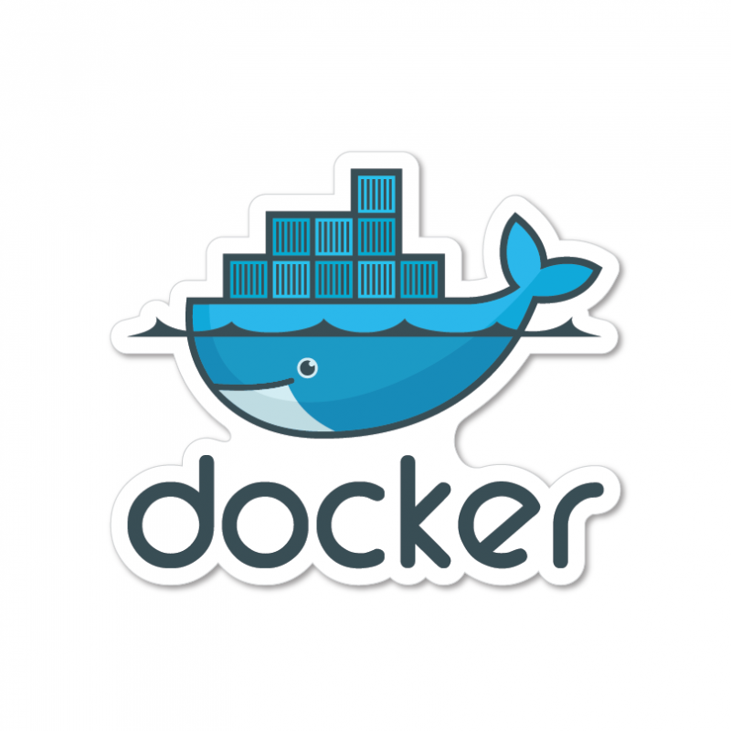
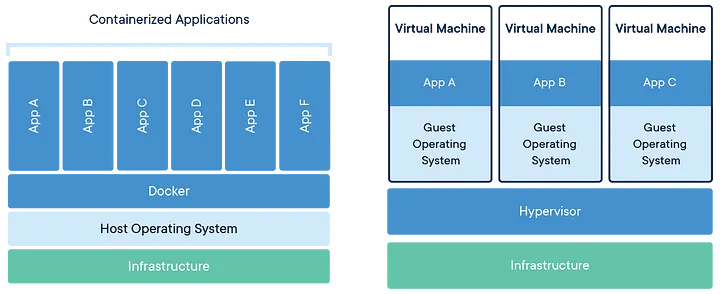
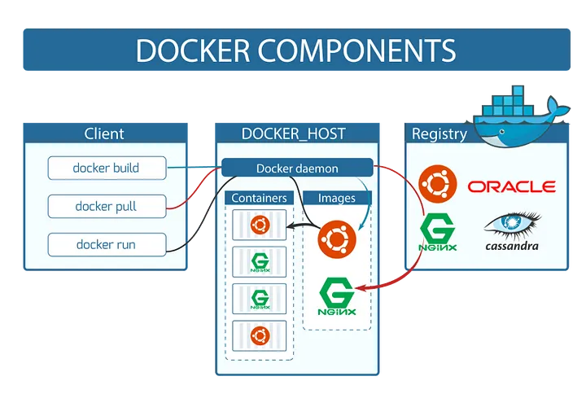

# Docker

Docker é uma plataforma voltada para a criação e execução de containers. Diferente de uma VM, um container empacota somente o código, dependências e variáveis de ambiente necessárias para a execução de uma aplicação. Sendo assim, ao invés de termos uma infraestrutura onde cada VM tem seu próprio SO sendo responsável por uma aplicação diferente, temos uma infraestrutura onde, com apenas um sistema operacional e através do Docker, podemos gerenciar diversas aplicações. Cada uma dessas aplicações é executada de forma isolada, sem a necessidade de um sistema operacional próprio.

## ⚙️ Estrutura do docker

Para um container ser criado, ele necessita de uma imagem: o básico para a aplicação ser executada, desde bibliotecas até variáveis de ambiente. Essas imagens são criadas através de um Dockerfile e podem ser baixadas e publicadas em diversos registries, sendo o mais famoso deles o Docker Hub. A imagem abaixo nos mostra um resumo do fluxo da estrutura do Docker e de como esses componentes se relacionam entre si.

⌨️ com ❤️ por [Elias Assunção](https://github.com/Hooligam) 🔥