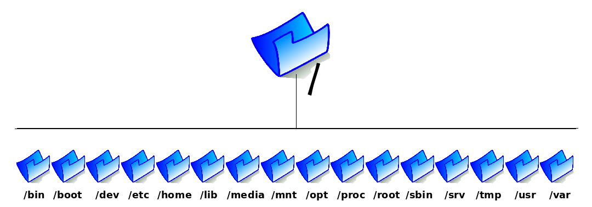

# Diretorios Linux



O diretório raiz está tomado pelas pastas do sistema e espera-se que você armazene seus arquivos pessoais dentro da sua pasta no diretório /home. A primeira coisa com que você precisa se habituar é que no Linux os discos e partições não aparecem necessariamente como unidades diferentes, como o C:, D:, E: do Windows. Tudo faz parte de um único diretório, chamado diretório raiz.  

```
/bin
```
Armazena os executáveis de alguns comandos básicos do sistema, como o su, tar, cat, rm, pwd, etc.

```
/usr
```
Armazena os executáveis de alguns comandos básicos do sistema, como o su, tar, cat, rm, pwd, etc.

```
/usr/lib
```
 Onde ficam armazenadas bibliotecas usadas pelos programas. As funções destas bibliotecas lembram um pouco a dos arquivos .dll no Windows. As bibliotecas com extensão .a são bibliotecas estáticas, enquanto as terminadas em .so.versão (xxx.so.1, yyy.so.3, etc.) são bibliotecas compartilhadas, usadas por vários programas e necessárias para instalar programas distribuídos em código fonte.

```
 /boot
```
Armazena (como era de se esperar) o Kernel e alguns arquivos usados pelo Lilo (ou grub, dependendo de qual você tiver instalado), que são carregados na fase inicial do boot.

```
 /dev
```
Que é de longe o exemplo mais exótico de estrutura de diretório no Linux. Todos os arquivos contidos aqui. Como por exemplo /dev/hda, /dev/dsp, /dev/modem, etc. não são arquivos armazenados no HD, mas sim links para dispositivos de hardware. Por exemplo, todos os arquivos gravados no “arquivo” /dev/dsp serão reproduzidos pela placa de som, enquanto o “arquivo” /dev/ttyS0 contém os dados enviados pelo mouse (ou outro dispositivo conectado na porta serial 1). Esta organização visa facilitar a vida dos programadores, que podem acessar o Hardware do micro simplesmente fazendo seus programas lerem e gravarem em arquivos. Não é preciso nenhum comando esdrúxulo para tocar um arquivo em Wav, basta “copiá-lo” para o arquivo /dev/dsp, o resto do trabalho é feito pelo Kernel. O mesmo se aplica ao enviar um arquivo pela rede, ler as teclas do teclado ou os clicks do mouse e assim por diante.

```
 /etc
```
Concentra os arquivos de configuração do sistema, substituindo de certa forma o registro do Windows. A vantagem é que enquanto o registro é uma espécie de caixa preta, os scripts do diretório /etc são desenvolvidos justamente para facilitar a edição manual. É verdade que na maioria dos casos isto não é necessário, graças aos inúmeros utilitários, mas a possibilidade continua aí. Os arquivos recebem o nome dos programas seguidos geralmente da extensão .conf. Por exemplo, o arquivo de configuração do serviço de dhcp é o dhcpd.conf, enquanto o do servidor proftp é o proftpd.conf. Claro, ao contrário do registro os arquivos do /etc não se corrompem sozinhos e é fácil fazer cópias de segurança caso necessário.

```
 /mnt
```
(de “mount”) recebe este nome justamente por servir de ponto de montagem para o CD-ROM (/mnt/cdrom), drive de disquetes (/mnt/floppy), drives Zip e outros dispositivos de armazenamento. O uso do diretório /mnt é apenas uma convenção. Você pode alterar o ponto de montagem do CD-ROM para /CD, ou qualquer outro lugar se quiser.

---
⌨️ com ❤️ por [Elias Assunção](https://github.com/Hooligam) 🔥