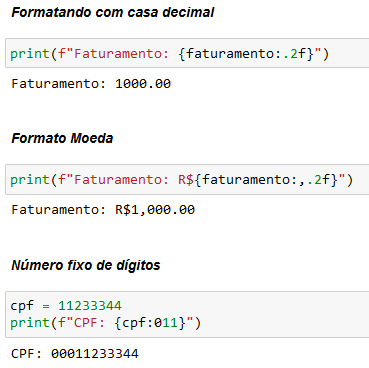

# Formatando textos no Python


Uma das coisas mais úteis de se fazer com texto é a interpolação de variáveis dentro do texto e a formatação de acordo com template pre-definido.

Python oferece 3 maneiras de fazer Interpolação, a primeira e mais antiga delas segue um padrão universal adotado em muitos sistemas e em outras linguagens de programação e utiliza o sinal de % como marcador de template.

## % 

Este tipo de formatação usa o % acompanhado de s para str, d para int, ou f para float, e além de demarcar o placeholder onde a substituição irá ocorrer também podemos definir a precisão numérica como em %.2f que significa que queremos imprimir apenas 2 casas decimais do número float.

```
>>> mensagem = "Olá %s, você é o participante número %d e pode ganhar %f pontos."
>>> nome = "Bruno"
>>> numero = 4
>>> pontos = 42.5
>>> print(mensagem % (nome, numero, pontos))
Olá Bruno, você é o participante número 4 e pode ganhar 42.500000 pontos.
```

## Format

Esta é a forma preferida para fazer interpolação de textos pois além de permitir a substituição de variáveis também permite a formatação dos valores, vejamos alguns exemplos:

```
>>> mensagem = "Olá {}, você é o participante número {} e pode ganhar {} pontos."
>>> print(mensagem.format(nome, numero, pontos))
Olá Bruno, você é o participante número 4 e pode ganhar 42.5 pontos.
```
Repare que ao invés de % agora usamos {} para marcar um placeholder e ao inves de % usamos a chamada do método .format do próprio tipo str para passar os valores em sequência.

E também podemos especificar tipos e a precisão numérica usando : e os mesmos marcadores dentro de {}.

## F strings

No Python 3 foi introduzido um atalho bastante útil para usar o format e de uma forma mais natural agora podemos escrever strings que se auto formatam usando as variáveis existentes, o funcionamento respeita as mesmas opções vistas anteriormente, o que muda é só a forma de escrever, ao invés de chamar explicitamente .format() usamos f"texto".

```
# Texto
>>> nome = "Bruno"
>>> f"{nome:*^11}"
'***Bruno***

# Número
>>> valor = 45.30000041
>>> f"{valor:*^11.2f}"
'***45.30***'
```
Uma útilidade interessante das f-strings é usar para fazer debugging.

```
>>> nome = "Bruno"
>>> print(f"{nome=}")
nome='Bruno'
```


⌨️ com ❤️ por [Elias Assunção](https://github.com/Hooligam) 🔥
