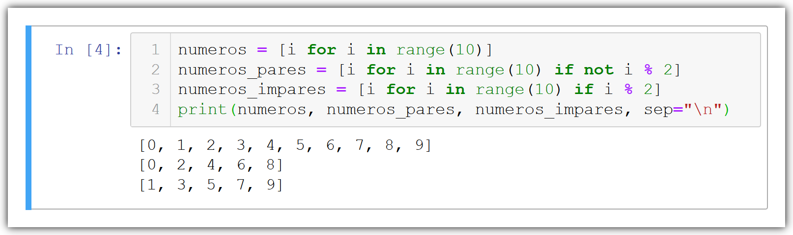

# Listas


Listas são bastante similares as tuplas e a maioria das operações que podemos fazer com tuplas também podemos fazer com as listas, uma das grandes diferenças está na implementação de protocolos de edição dos elementos, portanto as listas são mutáveis e permitem que incluamos novos itens, permitem a remoção de itens existentes e a reordenação.

As listas são criadas usando os literais [ ] ou a chamada para a classe list


## Criando uma lista vazia

```
colors = []
```
# E também é possível já iniciar uma lista com valores

```
colors = ["red", "green", "blue"]
```
## Adicionando elementos ao final da lista

Automaticamente todo elemento e adicionado ao final da lista
```
colors.append("green")
```
## Adicionando elementos ao inicio da lista

```
colors.insert(0, "red")
```
## Adicionando em uma posição especifica

Passar a posição que o elemento devera ser adicionado "lembrando que a primeira posição e a 0"
```
colors.insert(2, "blue")
```
## Obtendo o tamanho da lista

```
len(colors)
```
## Desempacotamento 

```
red, green, blue = colors
```
## E podemos extender uma lista in-place

```
>>> colors.extend(["purple"])
>>> print(colors)
["red", "green", "blue", "purple"]


# Ou usando um operador de acréscimo
>>> colors += ["purple"]
>>> print(colors)
["red", "green", "blue", "purple"]

```
## Remover elementos

```
colors.remove("purple")
```

## Contar elementos

Uma lista pode ter varios elementos iguais
```
>>> colors.count("green")
1=
```
⌨️ com ❤️ por [Elias Assunção](https://github.com/Hooligam) 🔥
