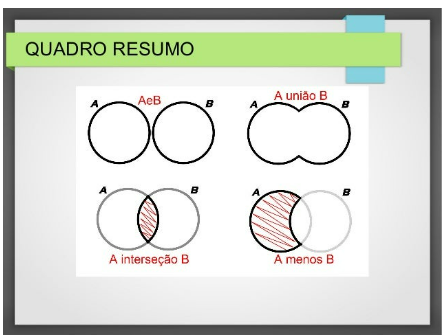

# Sets



Na antiga 5 séria (atual 1 ano do ensino médio) aprendemos a teoria dos conjuntos.

Python tem um tipo de objeto para representar este tipo composto, as caracteristicas de uso são bastante similares com listas e tuplas, mas é um objeto bastante particular e tem usos especificos.

## Sets podem ser criados usando as sintaxes:

```
# A partir de qualquer objeto iterável
iteravel = [1, 2, 3]  # list
iteravel = 1, 2, 3  # tuple
iteravel = "Banana"  # str

# usando a classe
set(iteravel)

# usando literais com { e }
{1, 2, 3, 4}

# desempacotando tuplas, listas ou textos
{*iteravel}
```
# Aplicamos a teoria dos conjuntos usando operadores


```
>>> conjunto_a = [1, 2, 3, 4, 5]
>>> conjunto_b = [4, 5, 6, 7, 8]

# | para união
>>> set(conjunto_a) | set(conjunto_b)
{1, 2, 3, 4, 5, 6, 7, 8}

# & para intersecção
>>> set(conjunto_a) & set(conjunto_b)
{4, 5}

# – para diferença
>>>  set(conjunto_a) - set(conjunto_b)
{1, 2, 3}

# para ^ diferença simétrica
>>> set(conjunto_a) ^ set(conjunto_b)
{1, 2, 3, 6, 7, 8}
```
## Interessante mas você pode estar se perguntando onde usar isso?

Pensa em uma rede social como o twitter, no conjunto A estao as pessoas que você segue, no conjunto B estão as que te seguem de volta, com este objeto você consegue determinar rapidamente quem não está te seguindo de volta.

Você pode também usar set para determinar quais seguidores você e algum amigo tem em comum na mesma rede social.

## Mutabilidade

Você pode criar um conjunto vazio e ir adicionando elementos e também pode remover elementos, eles são mutáveis.

## Deduplicação

Esta é uma das caracteristica mais interessante dos sets e talvez a sua maior utilidade, sets não permitem itens duplicados, então ao criar um set você elimina as duplicidades.
```
>>> conjunto = set()
>>> conjunto.add("Bruno")
>>> conjunto.add("Maria")
>>> conjunto.add("Bruno")
>>> conjunto.add("Maria")
>>> conjunto.add("Bruno")
>>> conjunto.add("Bruno")
>>> conjunto.add("Bruno")
>>> conjunto.add("Bruno")

# Digamos que por algum motivo (ou engano) adicionou o mesmo item mais de uma vez
# sem problemas :)

>>> print(conjunto)
{'Bruno', 'Maria'}

# E isso também functiona em tempo de atribuição
>>> {1, 2, 3, 1, 1, 1, 1, 5, 5, 5, 5}
{1, 2, 3, 5}
```
## Desvantagens dos sets?

Não respeitam a ordem de inserção, os elementos são ordenados automaticamente
Não permitem subscrição para acesso aos valores
Ou seja, você não pode fazer set[0] para acessar o primeiro elemento.


```
>>> conjunto = {4, 5, 6, 7, 8}

conjunto[0]
---------------------------------------------
TypeError   Traceback (most recent call last)
Input In [60], in <module>
----> 1 conjunto[0]

TypeError: 'set' object is not subscriptable
```

Mas pode usar in ou converter o set em uma lista.

```
>>> 4 in conjunto
True


>>> list(conjunto)[0]
4
```

⌨️ com ❤️ por [Elias Assunção](https://github.com/Hooligam) 🔥
