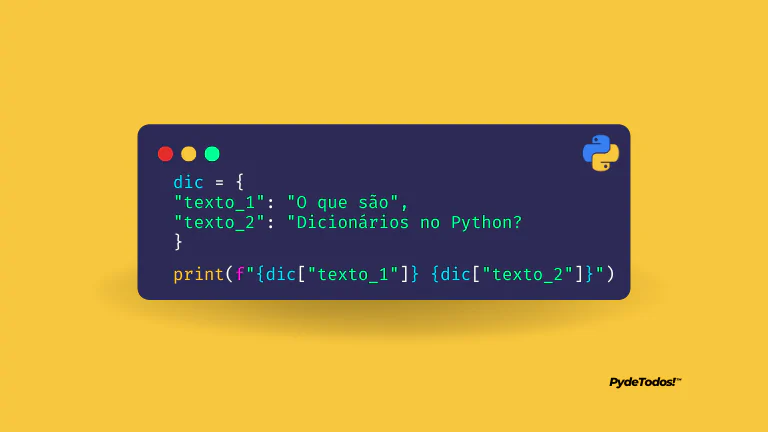

# Sets



Conhecidos também como HashMaps ou Arrays Associativos os dicionários são um misto entre o set e list e com certeza a estutura de dados mais importante da linguagem.


## Vamos entender para que servem os dicionários com este exemplo usando tipos primários.

```
produto_nome = "Caneta"
produto_cor1 = "azul"
produto_cor2 = "branco"
produto_preco = 3.23
produto_dimensao_altura = 12.1
produto_dimensao_largura = 0.8
produto_em_estoque = True
produto_codigo = 45678
produto_codebar = None
```
Acima estamos representando um único produto em um programa de vendas, é uma única caneta porém precisamos de 9 objetos de diferentes tipos.

E para resolver este problema que temos os tipos compostos, eles são containeres, objetos que podem agrupar mais de um tipo e mais de uma unidade de informação dentro deles.

Dicionários são criados com { } ou através da classe dict(), é bom ter cuidado para não os confundir com sets já que sets também usam { } e a diferença principal é o fato de que no set cada posição armazena apenas um valor e nos dicionários podemos colocar 2 valores em cada posição.

Um desses valores é chamado de chave key e o outro valor val e são separados por :, veja com um dicionário a mesma informação pode ser representada com:

```
produto = {
	"nome": "Caneta",
	"cor1": "azul",
	"cor2": "branco",
	"preco": 3.23,
	"dimensao_altura": 12.1,
	"dimensao_largura":  0.8,
	"em_estoque": True,
	"codigo": 45678,
	"codebar": None,
}
```
Agora temos um único objeto produto do tipo dict e isso torna nosso programa muito melhor organizado, facilita operações e deixa a complexidade menor também pois os dicionários assim como os sets também implementam a Hash Table, ou seja, as operação de acesso são O(1) super rápidas.

Assim como as listas os dicionários podem receber subscrições a partir de uma chave, ou seja, usamos [] e dentro passamos a key que queremos acessar.

Além disso podemos diminuir a redundancia colocando objetos compostos dentro do dicinário, ao invés de 2 chaves para representar cor podemos criar uma lista de cores e ao invés de 2 chaves para dimensoes podemos ter um subdicionário.

```
produto = {
	"nome": "Caneta",
	"cores": ["azul", "branco"],
	"preco": 3.23,
	"dimensao" {
        "altura": 12.1,
	    "largura":  0.8,
    },
	"em_estoque: True,
	"codigo": 45678,
	"codebar": None,
}
```
## Sintaxe

Podemos iniciar um dicionário vazio e depois ir adicionando elementos dentro dele.

```
cliente = {}
# ou
cliente = dict()
```

## CRUD

E usar as operações de CRUD (Create, Read, Update, Delete)

Criar - Adicionar chave+valor
```
cliente["nome"] = "Bruno"
```
Ler valor a partir de uma chave
```
>>> cliente["nome"]
'Bruno'
```
Update - Alterar valor a partir de uma chave
```
cliente["nome"] = "Bruno Rocha"
```
Delete - Remover um valor e sua chave.
```
del cliente["nome"]
```

## Buscas

O dicionário implementa Hash Table, ele também é conhecido como hash map e portanto as buscas em dicionário quando feitas por chave tem acesso constante O(1).
```
"nome" in cliente
True
```
in invoca o protocolo Lookupable através do método __contains__ e efetua a busca imediata sem necessidade de iterar todo o dicionário para encontrar uma chave, e assim como os sets as chaves não podem se repetir.

## Erros

Caso uma chave não exista no dicionário o Python estoura um erro chamado KeyError
```
print(cliente["telefone"])
...
KeyError 'telefone'
```
Para evitar o erro podemos usar o método get que busca a chave e caso não exista retorna um valor padrão que inicialmente é None
```
print(cliente.get("telefone"))
'None'

print(cliente.get("telefone", "191"))
'191'
```

⌨️ com ❤️ por [Elias Assunção](https://github.com/Hooligam) 🔥
