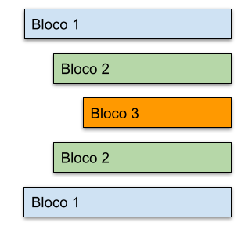

# Blocos de codigo e indentação


Identar um código é organizar e estruturar visualmente o código-fonte de um programa, inserindo espaços ou tabulações consistentes para destacar a hierarquia e a estrutura do código. A identação não altera o funcionamento do código, mas torna-o mais legível e compreensível para os programadores.

## 📦 Blocos

Em Python um bloco de código inicia sempre que existe a presença de : no final de uma linha.

```
if 1 > 2: #Inicio de um bloco
```

A linha que vem logo após o inicio do bloco deve obrigatoriamente ter um recuo (ou dente) e por isso chamamos de identação.
```
if 1 > 2:
    # aqui começa o código do bloco
    # o bloco pode ter muitas linhas
    # desde que mantenha o mesmo recuo
    # o recuo padrão é de 4 espaços.

```

### Dentro de um bloco de código podem existir muitos sub blocos, níveis internos de recuo, mas a recomandação é que no máximo existam 4.

```
if 1 > 2:
    # aqui inicia o bloco
    # recuo de 4 espaços

    while x < 10:
        # aqui inicia outro sub bloco
        # recuo de 8 espaços

        if x == 3:
            # ainda mais um bloco
            # recuo de 12 espaços

        # voltamos ao bloco anterior

    # agora voltamos para o bloco inicial

# e aqui continuamos o bloco principal (main)
```

A maior parte dos editores de código possui ferramentas que ajudam a visualizar as linhas de identação.


⌨️ com ❤️ por [Elias Assunção](https://github.com/Hooligam) 🔥