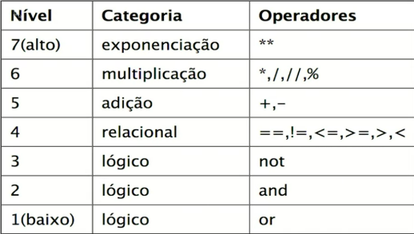

# Estudos iniciais sobre Python


O interpretador Python entende intruções que estão divididas em 3 categorias (expressions / statements / assignment)


## ➗ Expressions

Toda instrução que gera um processamento e espera um valor de retorno, exprimimos qual operação desejamos que seja computada usando funções ou operadores matemáticos e sempre esperamos obter um resultado para armazenar em variáveis ou efetuar operações de comparação.

Ex:Expressão literal, retorno o próprio número
```
>>> 1
1
```
Ex: Operações logicas
```
Resultado = 1 + 2
```

### Também existe a tabela de precedência de operadores do Python




## ⚙️ Statements

São formadas por uma ou mais palavras chave e servem para preparar o interpretador para efetuar alguma operação, são comandos que alteram estado ou declaram fluxo lógico.

Alguns statementes são:

**if, else, elif, for, while, pass, def**

Vamos aprofundar em cada um deles futuramente.

## ✅ Assignment

É o nome dado a expressão que pega o resultado de uma expressão e salva em uma variável atribuindo um nome/identificador ao resultado que pode ser usado como referencia para acesso.

A atribução é sempre feita com o sinal de **=** e do lado esquerdo definimos um identificador e do lado direito a expressão a ser atribuida.

No exemplo:
```
 total = preco * quantidade 
```
primeiro o Python resolve a expressão (preco * quantidade) resultando em um valor e então a apartir do sinal de = armazena como valor da variável


⌨️ com ❤️ por [Elias Assunção](https://github.com/Hooligam) 🔥